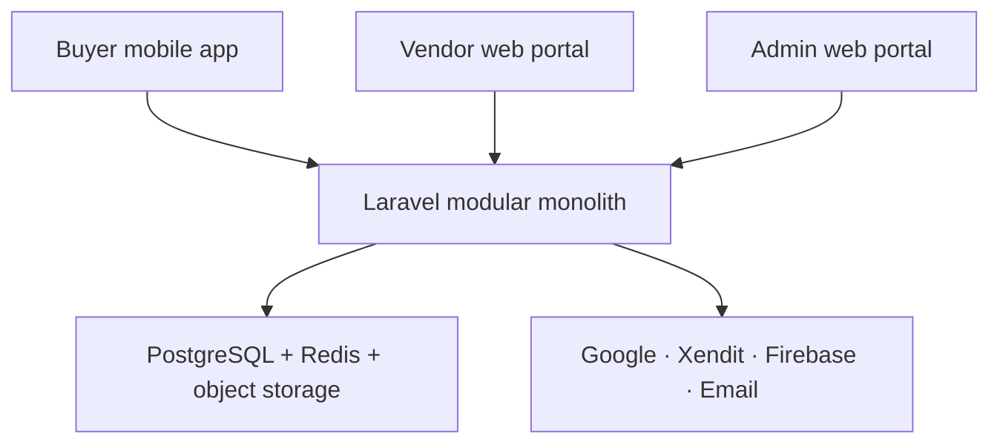
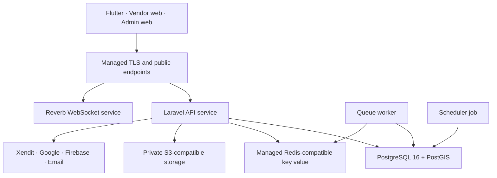
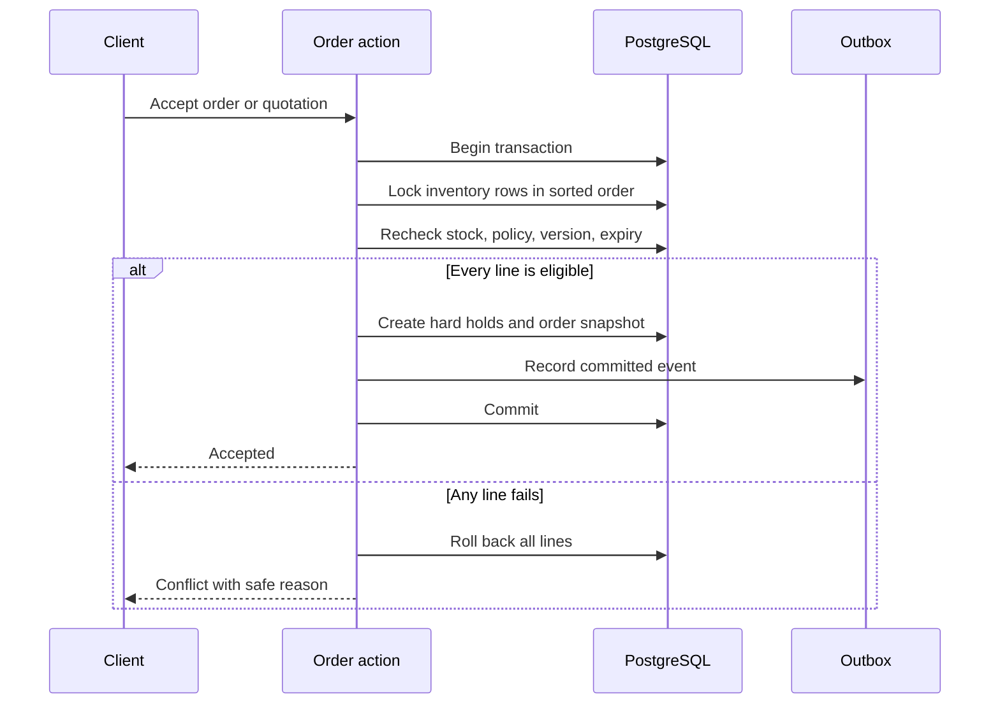

# MateryalPH Technical System Design

**Status:** Approved implementation baseline  
**Design date:** 4 September 2026; UI/repository baseline updated 5 September 2026  
**Canonical timezone:** Asia/Manila for business deadlines; UTC for stored timestamps  
**Architecture:** Modular monolith  
**Repository:** Existing early-stage monorepo; approved migration to standardized `apps/*`, `services/*`, and `packages/*` paths  
**Reference deployment:** Managed services on Render, Singapore region  

## 1. Confirmed Decisions

This design converts the approved System, Buyer, Vendor, and Admin workflows into a buildable system. It does not add a wallet, escrow, live delivery GPS, machine-learning ranking, Buyer organization accounts, multi-branch Vendor management, a competitive RFQ queue, vouchers, construction-vehicle rental, or procurement beyond 50 km.

The fixed application stack is:

| Surface or service | Technology | Responsibility |
| --- | --- | --- |
| Buyer application | Flutter and Dart | Buyer account, discovery, procurement, chat, orders, payments, disputes, and reports |
| Vendor portal | React 19, TypeScript, Vite 8, Tailwind CSS | Public Vendor landing page and authenticated Vendor operations |
| Admin portal | React 19, TypeScript, Vite 8, Tailwind CSS | Controlled verification, moderation, disputes, configuration, monitoring, and analytics |
| Shared backend | Laravel 13 and PHP 8.4 | Versioned REST API, domain rules, authentication, queues, schedules, integrations, and authorization |
| Database | PostgreSQL 16 with PostGIS, `pg_trgm`, and `pgcrypto` | Transactional data, geospatial search, fuzzy matching, constraints, and reporting |
| Cache and queues | Redis-compatible managed key-value service | Cache, rate limiting, queueing, locks, and short-lived state |
| Real time | Laravel Reverb | Authorized conversations, quotation updates, order milestones, and notifications |
| Local development | Docker Compose | Reproducible PostgreSQL, Redis, Mailpit, and S3-compatible object storage |
| CI/CD | GitHub Actions and Render Blueprint | Tests, security gates, staging deployment, and controlled production deployment |

Laravel 13 is pinned with Composer's `^13.0` constraint and PHP 8.4 is the reference runtime. Laravel 13 supports PHP 8.3 through 8.5 and receives security fixes through 17 March 2028; minor and patch updates may be applied after automated tests pass, while a future major upgrade requires an Architecture Decision Record and explicit approval. See the official [Laravel 13 release and support policy](https://laravel.com/docs/13.x/releases).

Laravel Passport is the reference OAuth2 implementation because the approved workflow explicitly requires short-lived signed access tokens, refresh tokens, revocation, and Authorization Code with PKCE. Passport signing keys must be loaded from protected environment configuration and never committed. The project will use Laravel 13's documented `php artisan install:api --passport` installation path, with explicit API guards, token lifetime limits, rotation/revocation tests, and protected deployment keys. See the official [Laravel 13 Passport documentation](https://laravel.com/docs/13.x/passport).

The approved interface reference is `docs/design/MateryalPH_UI_UX_Implementation_Planner.md`. It reconciles the existing Figma prototype with the final workflows and defines the design tokens, responsive layouts, map interactions, motion, component contracts, Figma-to-code process, and Impeccable quality workflow. Product behavior in the workflows overrides outdated prototype content.

## 2. Architecture Goals

The design prioritizes:

- One authoritative source of business rules across all three clients.
- Strong transactional consistency for inventory, payments, quotations, cancellations, and refunds.
- Deny-by-default authorization and organization-level data isolation.
- Immutable commercial snapshots and audit records.
- Clear separation of order, payment, fulfillment, refund, and dispute states.
- Accessible Buyer and portal experiences targeting WCAG 2.2 Level AA.
- Replaceable external integrations behind application interfaces.
- Safe local development and separate Development, Staging, and Production environments.
- A deployable capstone scope that can later be expanded without splitting into microservices prematurely.

## 3. System Context



All clients communicate only with `/api/v1`. Client applications never connect directly to PostgreSQL, Redis, private storage, Xendit secret endpoints, Google server APIs, or Firebase service-account endpoints.

## 4. Deployment Topology



The reference Render environment contains:

| Resource | Runtime | Scaling rule |
| --- | --- | --- |
| `materyalph-api` | Docker web service | Stateless; horizontal scaling is permitted |
| `materyalph-worker` | Docker background worker | Runs Laravel Horizon or a controlled queue worker |
| `materyalph-reverb` | Docker web service | Runs Reverb and accepts only authorized channel subscriptions |
| `materyalph-scheduler` | Cron service | Executes `php artisan schedule:run` once per minute |
| `materyalph-postgres` | Managed PostgreSQL 16 | Backups enabled; PostGIS, `pg_trgm`, and `pgcrypto` enabled |
| `materyalph-keyvalue` | Managed Redis-compatible service | Private connection only |
| `materyalph-vendor-web` | Static site | Built from `apps/vendor-web` |
| `materyalph-admin-web` | Static site | Built from `apps/admin-web` |

Render supports a repository-level `render.yaml`, monorepo Docker paths, background workers, cron jobs, environment groups, health checks, and deployment after CI checks. Render PostgreSQL supports PostGIS and `pg_trgm`. See the official [Blueprint specification](https://render.com/docs/blueprint-spec), [PHP/Laravel Docker deployment guide](https://render.com/docs/deploy-php-laravel-docker), and [PostgreSQL extension list](https://render.com/docs/postgresql-extensions). Because the Render tutorial may use an older framework example, the generated container, health check, build command, and start command must be tested against Laravel 13 and PHP 8.4 before Staging deployment.

Development and Staging use test or sandbox integrations. Production credentials are not created or entered until provider approval, legal review, privacy review, security review, and user-acceptance testing are complete.

## 5. Monorepo Structure

```text
materyalph/
├── AGENTS.md
├── README.md
├── SECURITY.md
├── CONTRIBUTING.md
├── compose.yaml
├── render.yaml
├── .gitignore
├── .editorconfig
├── .gitattributes
├── apps/
│   ├── buyer-mobile/
│   ├── vendor-web/
│   └── admin-web/
├── services/
│   └── api/
├── packages/
│   ├── api-contract/
│   ├── web-ui/
│   └── shared-config/
├── docs/
│   ├── workflows/
│   ├── architecture/
│   ├── api/
│   ├── adr/
│   ├── security/
│   ├── runbooks/
│   └── test-plans/
├── infrastructure/
│   ├── docker/
│   └── scripts/
└── .github/
    ├── workflows/
    └── pull_request_template.md
```

`packages/api-contract` contains the OpenAPI 3.1 document and generated TypeScript/Dart API clients. Generated clients are never edited manually. `packages/web-ui` contains shared accessible React components, tokens, and icons used by the Vendor and Admin portals without merging the two applications.

The current repository begins with `Flutter_Mobile_Interface_Buyer`, `React_Web_interface_Vendor`, `React_Web_interface_Admin`, and `Laravel_Main Application`. Before feature development, preserve history with reviewed Git moves into the structure above; update all scripts, imports, README commands, Docker contexts, and CI paths in the same change. Do not delete the working scaffold during this migration. The React scaffolds are migrated from JSX to strict TypeScript while retaining React 19 and Vite 8.

## 6. Backend Domain Modules

Laravel remains one deployable application, but code is separated by business domain under `app/Domain` and interface code under `app/Http`, `app/Console`, and `app/Integrations`.

| Domain | Main responsibility |
| --- | --- |
| Identity | Registration, email verification, password recovery, Google identities, sessions, TOTP, recovery codes, and devices |
| Authorization | Platform roles, Vendor memberships, permission policies, recent-authentication checks, and organization isolation |
| Agreements | Versioned Terms, Privacy Notice acknowledgment, Vendor Code of Conduct, NRPC Terms, and acceptance evidence |
| Buyers | Buyer profile, saved locations, preferences, favorites, privacy settings, and account states |
| Vendors | Vendor organization, public store, contacts, onboarding, classification, activation, staff, and Xendit connection state |
| Geography | Coordinates, radius rules, PSGC hierarchy, Google directory suppliers, geocoding, routing, and aggregation dimensions |
| Taxonomy | Canonical materials, aliases, categories, tags, compatible units, technical attributes, and regulated mappings |
| Catalog | Products, listings, variants, media, price snapshots, public availability, and publication gates |
| Compliance | Business documents, PS/ICC evidence, OCR/QR assistance, official-source comparison, and Admin decisions |
| Inventory | On-hand stock, reservations, soft holds, movements, stale-stock confirmation, and auto-accept policies |
| Procurement | Carts, checkouts, projects, Work Packages, compiled estimates, SRS, FMS, ranking preferences, and budget controls |
| Conversations | Conversations, participants, messages, attachments, staff identity, transfers, and read state |
| Quotations | Shared Item/Project quotation engine, immutable versions, counter-offers, deadlines, changes, and acceptance |
| Orders | Vendor child orders, immutable commercial snapshots, confirmations, NRPC, status transitions, and cancellation |
| Payments | Xendit requests, processing-fee disclosure, webhooks, reconciliation, payment purposes, and physical-payment records |
| Refunds | Cancellation Refund, Dispute-Conclusion Refund, and technical compensation as distinct idempotent triggers |
| Fulfillment | Preparation, vehicle assignment, delivery/pickup milestones, proof, auto-completion, and no-show handling |
| Disputes | Cases, evidence, responses, mutual resolution, decisions, appeals, remedies, and case deadlines |
| Trust | Verified reviews, score windows, badge evaluation, fraud exclusions, and price insights |
| Notifications | In-app, push, email, preference enforcement, templates, delivery attempts, and reminders |
| Reporting | PDFs, CSV exports, operational reports, invoices, Buyer budget reports, and authorized Admin exports |
| Analytics | Aggregate facts, Philippine map metrics, active-user definitions, demand heatmaps, and small-cell suppression |
| Audit | Append-only audit events, correlation identifiers, evidence references, access logs, and export events |

Domain services must not call external providers directly. They call interfaces such as `PaymentGateway`, `MapProvider`, `ObjectStorage`, `MailProvider`, `PushProvider`, and `ComplianceReferenceProvider`. Provider adapters implement those interfaces.

## 7. Code Organization and Dependency Rules

Each domain uses this internal pattern:

```text
Domain/<Name>/
├── Actions/          # one business use case per class
├── Data/             # immutable data-transfer objects
├── Enums/            # PHP backed enums mirroring documented states
├── Events/           # committed domain events
├── Exceptions/       # safe business exceptions
├── Jobs/             # idempotent queued work
├── Models/           # Eloquent persistence models
├── Policies/         # resource authorization
├── Queries/          # optimized read models
├── Rules/            # reusable validation rules
├── Services/         # cohesive domain services
└── Support/          # domain-specific helpers
```

Controllers validate transport concerns, call one application action, and return an API Resource. Controllers must not contain commercial calculations, authorization shortcuts, or state-transition logic. Models must not call external providers. Queued jobs must be idempotent and safe to retry.

Cross-domain changes use an explicit application service and one database transaction when immediate consistency is required. Noncritical side effects use an outbox event committed in the same transaction and dispatched after commit.

## 8. Database Design

### 8.1 Storage Conventions

- Business tables use application-generated UUIDv7 primary keys.
- Human-facing references use separate non-secret codes such as `ORD-2026-...` and `CASE-2026-...`.
- Money is stored as integer centavos in `BIGINT`; PHP value objects prevent binary floating-point calculations.
- Quantities use `NUMERIC(18,4)` and always reference a canonical unit.
- Timestamps use `TIMESTAMPTZ`, are stored in UTC, and are rendered in Asia/Manila for deadlines.
- Geographic points use `geography(Point,4326)` with GiST indexes.
- Controlled states use PHP backed enums plus database `CHECK` constraints. State changes require migrations.
- Email uniqueness uses normalized lowercase values and a case-insensitive unique index.
- Mutable resources have an integer `lock_version` for optimistic concurrency where appropriate.
- Immutable commercial versions, payment events, webhook events, audit events, and decisions are never soft-deleted.
- File records store metadata and object keys only; file bytes remain in private object storage.
- Foreign keys are required. Cascading delete is prohibited where it could erase financial, order, compliance, or audit history.

### 8.2 Table Groups

The Phase 1 schema creates the complete baseline below. Later phases may add additive migrations, but they must not redefine an existing concept under a second name.

| Group | Required tables |
| --- | --- |
| Identity | `users`, `user_profiles`, `external_identities`, `email_otps`, `auth_sessions`, `trusted_devices`, `totp_factors`, `recovery_codes`, `login_events`, Passport OAuth tables |
| Agreements | `agreement_documents`, `agreement_versions`, `agreement_acceptances` |
| Authorization | `platform_roles`, `permissions`, `role_permissions`, `admin_memberships`, `admin_invitations` |
| Vendor organization | `vendor_organizations`, `vendor_memberships`, `vendor_invitations`, `vendor_contacts`, `vendor_classifications`, `vendor_onboarding_steps`, `vendor_activation_history` |
| Store and address | `store_profiles`, `addresses`, `store_media`, `operating_hours`, `delivery_service_areas` |
| Verification | `business_documents`, `business_document_versions`, `business_document_reviews`, `vendor_payment_accounts` |
| Taxonomy | `material_categories`, `materials`, `material_aliases`, `units`, `unit_conversions`, `material_tags`, `material_tag_links`, `technical_attribute_definitions`, `regulated_material_rules` |
| Catalog | `products`, `vendor_listings`, `listing_variants`, `listing_media`, `listing_price_versions`, `listing_status_history` |
| Compliance | `compliance_submissions`, `compliance_evidence`, `compliance_extractions`, `compliance_reference_matches`, `compliance_reviews` |
| Inventory | `inventory_items`, `inventory_movements`, `inventory_holds`, `auto_accept_policies`, `auto_accept_policy_versions`, `stock_confirmation_events` |
| Delivery | `vendor_vehicles`, `vehicle_rate_versions`, `delivery_quotes`, `delivery_assignments` |
| Buyer | `buyer_profiles`, `buyer_locations`, `favorite_vendors`, `buyer_ranking_preferences` |
| Item procurement | `carts`, `cart_items`, `checkout_groups`, `checkout_vendor_groups` |
| Project procurement | `projects`, `project_sites`, `work_packages`, `work_package_versions`, `work_package_lines`, `compiled_estimates`, `compiled_estimate_lines`, `compiled_estimate_vendors`, `budget_overrides` |
| Messaging | `conversations`, `conversation_participants`, `conversation_assignments`, `messages`, `message_attachments`, `message_read_receipts` |
| Quotations | `quotations`, `quotation_versions`, `quotation_lines`, `quotation_changes`, `quotation_counter_offers`, `quotation_events` |
| Orders | `orders`, `order_lines`, `order_snapshots`, `order_status_history`, `vendor_confirmations`, `nrpc_records`, `nrpc_acceptances`, `cancellation_requests`, `cancellation_decisions` |
| Payments | `payments`, `payment_attempts`, `payment_events`, `physical_payment_records`, `processing_fee_snapshots` |
| Refunds | `refunds`, `refund_attempts`, `refund_events` |
| Fulfillment | `fulfillments`, `fulfillment_milestones`, `fulfillment_proofs`, `pickup_authorizations`, `no_show_events` |
| Disputes | `dispute_cases`, `dispute_parties`, `dispute_evidence`, `dispute_responses`, `dispute_clarifications`, `dispute_decisions`, `dispute_appeals`, `dispute_remedies` |
| Reviews and scores | `reviews`, `review_media`, `review_moderation`, `metric_events`, `score_snapshots`, `badge_definitions`, `vendor_badge_history`, `price_observations` |
| Geography | `psgc_versions`, `psgc_areas`, `psgc_boundaries`, `directory_suppliers`, `place_cache_entries`, `route_cache_entries` |
| Operations | `notifications`, `notification_deliveries`, `notification_preferences`, `files`, `webhook_events`, `idempotency_records`, `outbox_events`, `audit_logs`, `privacy_requests`, `data_exports`, `platform_settings` |
| Analytics | `analytics_daily_facts`, `analytics_geography_facts`, `analytics_category_facts`, `analytics_active_user_facts`, `analytics_refresh_runs` |

### 8.3 Critical Constraints

1. One user email maps to one MateryalPH identity; roles and memberships do not create duplicate accounts.
2. A Vendor membership belongs to exactly one Vendor organization in the capstone.
3. A Vendor user has exactly one fixed Vendor role at a time.
4. Only one active Vendor Owner membership exists per Vendor organization.
5. Store Manager staff delegation defaults to false and cannot be granted by another Store Manager.
6. Tier 1 directory suppliers cannot own listings, conversations, quotations, orders, reviews, or Xendit accounts.
7. A Vendor child order contains lines from exactly one Vendor.
8. A Work Package can have many inquiries but only one selected Vendor and accepted quotation/order outcome.
9. Published quotation versions are immutable. `quotations.current_version_id` points to the latest valid version.
10. Accepting a quotation requires its version to equal `current_version_id` and its expiry to be in the future.
11. Each payment has one purpose: `FULL_ORDER_PAYMENT`, `NRPC_ASSURANCE_PAYMENT`, or `ORDER_BALANCE_PAYMENT`.
12. Each refund has one trigger: `CANCELLATION`, `DISPUTE_CONCLUSION`, or `TECHNICAL_COMPENSATION`.
13. A Dispute-Conclusion Refund requires a concluded decision that awards an amount. A Cancellation Refund requires a finalized paid cancellation.
14. `available_to_sell = quantity_on_hand - hard_reserved_quantity`; soft holds are reported separately.
15. Inventory reservation and auto-accept updates lock all affected rows in a deterministic order and succeed or fail as one transaction.
16. NRPC is disabled by default, manually entered, supported by a reason, accepted before payment, and unavailable to auto-accept.
17. Buyer cancellation is unavailable at `READY_FOR_PICKUP` and `OUT_FOR_DELIVERY`; dispute and statutory remedies remain available.
18. Audit rows are append-only at the application role level. Corrections create a compensating event.

### 8.4 High-Contention Inventory Transaction



Use `SELECT ... FOR UPDATE`, deterministic row ordering, database constraints, and retry handling for deadlocks. Never check stock in PHP and update it later in a separate transaction.

## 9. API Design

### 9.1 Contract Rules

- Base path: `/api/v1`.
- Contract format: OpenAPI 3.1 under `packages/api-contract/openapi.yaml`.
- JSON envelope: `{ "data": ..., "meta": ..., "errors": [...] }`.
- Error objects contain `code`, `message`, `field`, `correlation_id`, and optional safe details.
- Resource identifiers are opaque UUIDs; authorization is still required after lookup.
- All list endpoints are paginated and bounded.
- Cursor pagination is used for conversations, notifications, and audit feeds.
- Administrative queues may use page pagination with documented stable sorting.
- Mutating retry-sensitive endpoints require `Idempotency-Key`.
- State-changing requests may require `If-Match` or an explicit version number.
- Every response includes a correlation ID.
- Breaking changes require `/api/v2`; additive changes remain in v1.

### 9.2 Endpoint Families

| Prefix | Examples |
| --- | --- |
| `/auth` | register, verify email, login, refresh, logout, Google callback/exchange, recover, TOTP, sessions |
| `/agreements` | current documents, acceptances, required reacceptance |
| `/buyers` | profile, locations, preferences, favorites, privacy requests |
| `/vendors` | public store, onboarding, contacts, documents, activation, team, payment connection |
| `/taxonomy` | categories, materials, aliases, units, technical fields, Admin changes |
| `/listings` | create, edit, variants, media, price versions, publication, search |
| `/compliance` | submission, extraction, evidence, reference match, Admin decision |
| `/inventory` | balances, movements, reservations, stale confirmation, imports, auto-accept |
| `/geography` | PSGC hierarchy, geocoding, directory suppliers, radius search, routes |
| `/carts` and `/checkouts` | cart validation, Vendor grouping, preview, submit |
| `/projects` and `/work-packages` | budgets, versions, scan, estimates, inquiry, selection |
| `/conversations` | participants, assignments, messages, attachments, receipts |
| `/quotations` | draft, publish, revise, counter, accept, reject, withdraw, expire |
| `/orders` | confirmation, revision, NRPC, payment readiness, transitions, cancellation |
| `/payments` | create, status, reconcile; never accept a client-supplied success state |
| `/refunds` | authorized status only; creation is restricted to domain triggers |
| `/fulfillments` | prepare, ready, dispatch, proof, receipt, report problem |
| `/disputes` | file, respond, clarify, decide, appeal, remedy status |
| `/reviews` and `/scores` | eligible review, moderation, snapshots, badges, price insights |
| `/notifications` | feed, read state, preferences, registered devices |
| `/admin` | queues, users, settings, audits, integrations, exports, aggregate analytics |
| `/webhooks/xendit` | raw provider events with verification, replay protection, and idempotency |

### 9.3 Idempotency Contract

For a protected mutation, the server stores the user or system actor, endpoint, key, canonical request hash, result status, response body, and expiry. Reusing the same key and same payload returns the original result. Reusing it with a different payload returns `409 IDEMPOTENCY_KEY_REUSED`. Payment/refund keys remain retained according to the financial-record policy and are not treated like short-lived ordinary request keys.

## 10. Authentication and Session Design

### 10.1 Token Model

| Client | Access token | Refresh token | Storage |
| --- | --- | --- | --- |
| Vendor/Admin web | Short-lived Passport access token in `Secure`, `HttpOnly` cookie | Rotating refresh token in a separately scoped `Secure`, `HttpOnly` cookie | Never local storage or session storage |
| Buyer mobile | Short-lived bearer access token | Rotating refresh token bound to device session | OS secure storage only |

Reference defaults:

- Access token: 15 minutes.
- Refresh-session maximum: 14 days for ordinary users.
- Inactivity and absolute-session limits are enforced server-side.
- Privileged Vendor and Admin actions require recent authentication within 15 minutes.
- Refresh-token rotation revokes the previous token. Reuse detection revokes the token family and alerts the user.

### 10.2 Registration and Login Rules

- Email/password registration sends a six-digit OTP that expires in 10 minutes, is stored only as a keyed hash, permits five attempts, and has a 60-second resend cooldown.
- Google sign-in uses Authorization Code with PKCE. The backend validates issuer, audience, signature, expiry, nonce, state, and `email_verified`; it stores Google's stable `sub` as the external identity.
- A valid Google registration does not send a duplicate email OTP.
- Admin accounts have no public registration and are created by protected invitation.
- Vendor Owner, delegated Store Manager, and Administrator sessions require authenticator-app TOTP before privileged access.
- Buyer routine login on a recognized device requires only password or Google authentication. Recovery, suspicious login, password/security change, or a new device may require email OTP step-up.
- Password reset, email change, factor reset, suspension, deactivation, and “sign out all devices” revoke applicable sessions.
- Login and recovery responses do not reveal whether an account exists.

Google's official OIDC guide requires server-side authorization-code exchange and validation of ID-token claims; see [Google OpenID Connect](https://developers.google.com/identity/openid-connect/openid-connect).

## 11. Authorization Model

Authorization checks combine platform type, account state, organization membership, fixed role, delegation flag, permission, ownership, resource state, and recent-authentication requirement.

### 11.1 Vendor Role Summary

| Action | Owner | Manager | Store Staff | Customer Service | Inventory | Fulfillment |
| --- | :---: | :---: | :---: | :---: | :---: | :---: |
| Store-wide control | Yes | Operational | No | No | No | No |
| Manage non-manager staff | Yes | Only if delegated | No | No | No | No |
| Create another Manager | Yes | No | No | No | No | No |
| Publish quotation | Yes | Yes | Yes | No | No | No |
| Set order NRPC | Yes | Yes | Yes | No | No | No |
| Confirm unchanged order | Yes | Yes | Yes | Yes | No | No |
| Manage inventory/listings | Yes | Yes | Yes | No | Yes | No |
| Submit PS/ICC evidence | Yes | Yes | Yes | No | Yes | No |
| Configure auto-accept | Yes | Yes | Limited allotment only | No | Limited allotment only | No |
| Record fulfillment proof | Yes | Yes | No | No | No | Yes |
| Payout/Xendit settings | Yes | No | No | No | No | No |
| Legal ownership/account deletion | Yes | No | No | No | No | No |

All rules are implemented as backend policies and feature tests. Hiding a navigation item is only a user-interface convenience.

### 11.2 Admin Roles

- Super Admin.
- Vendor Verification Staff.
- Product Compliance Staff.
- Order and Dispute Staff.
- User Management Staff.
- Support Staff.

One role is active at a time. Aggregate geographic analytics use a separate permission. Secret access, payout control, audit deletion, self-approval, and administrative TOTP bypass are never portal permissions.

## 12. Canonical State Machines

### 12.1 Order

```text
AWAITING_VENDOR_CONFIRMATION
  → AWAITING_BUYER_APPROVAL (when revised)
  → AWAITING_NRPC_ACCEPTANCE (when NRPC proposed)
  → AWAITING_PAYMENT
  → CONFIRMED
  → PROCESSING
  → READY_FOR_PICKUP | OUT_FOR_DELIVERY
  → PICKED_UP | DELIVERED
  → COMPLETED
```

Exceptional states are `DECLINED`, `EXPIRED`, `CANCELLATION_REQUESTED`, `CANCELLED`, and `DISPUTED`. The transition service owns the allowed transition table and records actor, role, old state, new state, reason, evidence, and timestamp.

### 12.2 Payment and Refund

Payment states: `NOT_REQUIRED`, `PENDING`, `PAID`, `FAILED`, `EXPIRED`.

Refund states: `NOT_REQUESTED`, `REFUND_PENDING`, `PARTIALLY_REFUNDED`, `REFUNDED`, `REFUND_FAILED`.

A redirect never marks payment as paid. Only a verified Xendit webhook or authoritative reconciliation may do so. Xendit recommends authenticated webhook handling and validation of transaction IDs and amounts; see [Xendit integration security](https://docs.xendit.co/docs/integration-security).

### 12.3 Quotation

`DRAFT → PUBLISHED → ACCEPTED | REJECTED | COUNTERED | EXPIRED | WITHDRAWN`.

Editing a published quotation creates a new version, supersedes the prior version, resets the displayed deadline, and prevents stale acceptance. A pending soft hold never guarantees stock. Acceptance revalidates stock atomically before a hard reservation and order are created.

### 12.4 Dispute

`OPEN_AWAITING_RESPONSE → MUTUAL_RESOLUTION | ESCALATED_ADMIN_REVIEW → AWAITING_CLARIFICATION → DECIDED → APPEAL_OPEN | RESOLVED`.

`CLOSED_INCONCLUSIVE` is a permitted terminal outcome. Filing does not create a refund. A concluded award creates a separate Dispute-Conclusion Refund.

## 13. External Integration Boundaries

### 13.1 Google

- Separate Development, Staging, and Production Google Cloud projects.
- Separate restricted keys for Android, iOS, browser, and backend server use.
- Enable only the required APIs: Maps SDKs, Maps JavaScript API, Places API (New), Routes API, and required geocoding capability.
- Apply Android package/SHA, iOS bundle, HTTP-referrer, API, and server restrictions as appropriate.
- Request only required Places fields; preserve attribution and comply with caching limits.
- PostGIS performs radius filtering first. Routes calls are reserved for shortlisted results and fee/ETA confirmation.

Google strongly recommends application and API restrictions on Maps keys. See [Google Maps security guidance](https://developers.google.com/maps/api-security-best-practices) and [Places API setup](https://developers.google.com/maps/documentation/places/web-service/get-api-key).

### 13.2 Xendit

- Backend-only secret keys.
- Test Mode in Development and Staging.
- One Vendor sub-account reference per activated Vendor organization.
- Server-calculated amount, fee snapshot, order reference, idempotency key, and payment purpose.
- Verified callback token, event uniqueness, amount and reference comparison, and replay-safe processing.
- Payment and refund state changes occur asynchronously.
- Cancellation Refund and Dispute-Conclusion Refund are different internal records even if both call the same provider endpoint.
- Refund destination is the original supported payment method; the UI never asks the Buyer to redirect the refund.
- Unsupported-refund channels remain disabled for the MVP unless an approved fallback is documented.

Xendit documents separate test keys, server authentication, and non-banking test transactions in its [API quick setup](https://docs.xendit.co/apidocs/quick-setup). Sub-account payment routing and refunds must follow the active contract and current [sub-account](https://docs.xendit.co/docs/accepting-payments-for-sub-accounts) and [refund](https://docs.xendit.co/docs/refund-payment-request) documentation.

### 13.3 Files

All uploads use a `files` record with owner, purpose, visibility, content type, byte size, checksum, scan state, object key, retention class, and timestamps. Compliance documents, fulfillment proof, invoices, dispute evidence, and identity-related documents are private. Downloads use short-lived signed URLs after authorization. Production requires content sniffing, allowlisted types, file-size limits, image re-encoding where safe, and malware scanning.

### 13.4 Notifications

The server stores the authoritative notification first. Email and push delivery are queued side effects. Delivery failure never rolls back an order or payment transaction. Mandatory security, payment, dispute, enforcement, and legal notices cannot be disabled. No SMS provider is used.

## 14. Ranking, Scores, and Analytics

Normalized weighted sums are used, never multiplied scores.

```text
SRS = Distance 30% + Price 25% + VPS 20% + Stock 15% + Product Rating 10%
FMS = Material Match 40% + Budget Fit 25% + Distance 20% + VPS 15%
VPS = VCS 50% + OHS 50%
```

Buyer overrides for Item-Based and Project-Based procurement are stored separately, must total 100%, cannot be all zero, and can be reset to platform defaults.

Analytics are generated from transactional events into daily aggregate facts. Dashboard requests never calculate every metric from raw orders synchronously. Geography uses versioned PSGC codes and boundaries. Small cells are suppressed or generalized according to a configured privacy rule. Exact Buyer coordinates are not exposed by aggregate-map permission.

## 15. Security Design

### 15.1 Non-Negotiable Secret Controls

- `.gitignore` exists before the first commit and ignores every real environment file and credential artifact.
- The repository contains `.env.example` or equivalent example files with names only and no secret values.
- Development, Staging, and Production use different credentials and secret stores.
- Secret values are at least 32 random characters when the provider permits caller-generated values.
- Secrets are never placed in source code, screenshots, issues, documentation examples, chat prompts, console logs, exception reports, or mobile binaries.
- Server keys never use a `VITE_` prefix or a Flutter compile-time public configuration path.
- Rotation occurs every 90 days and immediately after suspected exposure.
- GitHub and Render environment secrets are entered through their protected interfaces, not committed YAML values.
- Pre-commit and CI secret scanning block likely credentials.

GitHub describes encrypted repository/environment secrets in its [Actions secrets guidance](https://docs.github.com/en/actions/how-tos/write-workflows/choose-what-workflows-do/use-secrets). The rotation inventory and incident procedure follow [OWASP Secrets Management](https://cheatsheetseries.owasp.org/cheatsheets/Secrets_Management_Cheat_Sheet.html).

### 15.2 Application Controls

- TLS in transit and managed encryption at rest.
- Argon2id password hashing.
- CSRF protection for cookie-authenticated web mutations.
- Strict CORS allowlist.
- Content Security Policy and secure headers.
- Server-side validation and output encoding.
- Rate limits by route, account, IP, device, and organization where appropriate.
- File validation and malware scanning.
- Webhook verification and replay protection.
- Database parameter binding.
- Log redaction and personal-data minimization.
- Backups, restore drills, dependency scanning, static analysis, and audit trails.

## 16. Reliability and Consistency

- PostgreSQL is authoritative for commercial state.
- Redis is never the only store for an order, payment, refund, permission, or audit fact.
- The outbox pattern prevents a committed transaction from losing its notification or integration job.
- Every queued job defines an idempotency key and bounded retry/backoff policy.
- Dead-letter or failed jobs appear in the Admin Integration and Job Health queue.
- Provider timeouts produce pending or retryable states, not guessed success.
- Reconciliation jobs compare local payment/refund records with provider state.
- All scheduled deadlines are stored as exact UTC instants derived from Asia/Manila business rules.

## 17. Testing Strategy

| Test level | Required coverage |
| --- | --- |
| Unit | Money, scores, deadlines, state transitions, eligibility, NRPC, fee and refund calculations |
| Feature/API | Validation, authorization, ownership, response schemas, idempotency, rate limits, and failure paths |
| Database | Constraints, unique indexes, geospatial queries, deadlocks, atomic stock reservations, and rollback behavior |
| Contract | OpenAPI validation and generated TypeScript/Dart client compatibility |
| Integration | Google adapters, Xendit sandbox, webhook signatures/replays, storage, email, FCM, and Reverb |
| UI component | Accessible controls, errors, loading, empty states, and permission visibility |
| End to end | Buyer-to-Vendor-to-Admin critical journeys across real clients and API |
| Security | OWASP checks, dependency audit, secret scan, authorization matrix, upload abuse, and session handling |
| Accessibility | Keyboard, screen reader labels, focus, contrast, reflow, target size, and non-color status |
| Performance | Search, map aggregation, message pagination, checkout, inventory contention, and dashboard queries |
| Recovery | Database restore, failed job replay, webhook replay, refund reconciliation, and deployment rollback |

No phase is complete if its automated tests fail, the OpenAPI contract is stale, the migration cannot run from an empty database, or a secret appears in Git history.

## 18. Observability

- Structured JSON logs with correlation ID, actor ID where lawful, domain, event, result, and duration.
- Never log passwords, OTPs, refresh tokens, private keys, full payment details, private file URLs, or unnecessary evidence content.
- Health endpoints: `/up` for process readiness and protected deeper diagnostics for dependencies.
- Metrics: HTTP error/latency, queue age/failure, Reverb connections, database pool, webhook lag, payment/refund reconciliation, email/push failures, and analytics freshness.
- Alerts: API unavailable, queue backlog, failed scheduled job, webhook verification failures, payment divergence, refund failure, database storage/connection pressure, and backup failure.

## 19. CI/CD Gates

Every pull request must pass:

1. Secret scan.
2. Formatting and linting.
3. PHP static analysis.
4. Laravel unit and feature tests against PostgreSQL/PostGIS.
5. React tests and production builds for both portals.
6. Flutter analysis and tests.
7. OpenAPI validation and generated-client drift check.
8. Dependency and container vulnerability checks.
9. Migration-from-empty test.
10. Authorization and critical state-machine tests.

Staging deploys only after CI passes. Production requires a tagged release, approved migration plan, backup verification, smoke-test checklist, and rollback plan. Render supports deploy-after-CI and managed TLS; see [Render deploys](https://render.com/docs/deploys) and [Render TLS](https://render.com/docs/tls).

## 20. UI Architecture and Design Quality

The UI architecture is governed by `MateryalPH_UI_UX_Implementation_Planner.md` and the approved Figma file. The Figma file supplies visual intent only; workflows, state machines, authorization, provider policy, and accessibility requirements remain authoritative.

- Buyer uses a feature-oriented Flutter design system generated from `packages/design-tokens/tokens.json`.
- Vendor and Admin use React 19/TypeScript/Vite 8 with Tailwind semantic aliases and accessible primitives from `packages/web-ui`.
- Inter is the approved typeface. The approved construction palette uses `#F97316` as its central brand accent, with a deeper accessible action color for white-label filled buttons.
- Buyer Map Home is the default authenticated page. It displays zoom-aware clusters and store-name labels; Tier 2 shows VPS or New Vendor, while Tier 1 shows Directory.
- A Tier 2 pin selection animates one route from the active Buyer/Project origin, then opens a preview with an explicit View Store action. A Tier 1 selection opens attributed Google Place Details and never exposes transaction actions or VPS.
- Project-Based Procurement reuses the same map/route components with the Project site as origin and eligible Tier 2 candidates only. Candidate details add FMS, match, budget, quotation, note, comparison, and Work Package inquiry actions.
- The route-line animation is a one-time decision aid, not live delivery tracking. Reduced-motion settings render the final state without animation.
- Every map has a synchronized accessible list and complete denied-location, offline, provider-failure, stale-response, empty, and retry behavior.
- Impeccable is installed project-locally for design critique, hardening, motion review, audits, polish, and deterministic React checks. It does not override product truth or native Flutter/accessibility tests.

UI pull requests must include relevant component/widget tests, responsive evidence, accessibility results, deliberate Figma deviations, and design-quality findings or narrowly documented exceptions.

## 21. Definition of Production Ready

MateryalPH is ready for live production only when:

- All 20 implementation phases are complete and accepted.
- Staging end-to-end and user-acceptance tests pass.
- Xendit live-account capabilities and refund channels are confirmed in writing.
- Google keys have correct application, API, quota, and billing restrictions.
- The Data Protection Officer or authorized privacy reviewer approves notices, retention, rights handling, and processor arrangements.
- Philippine legal and tax reviewers approve payment-fee pass-through, NRPC Terms, refund disclosures, invoice wording, and marketplace obligations.
- Backups and restore have been tested.
- Monitoring, alerts, incident response, key rotation, support ownership, and rollback are operational.
- No seeded test identity, default password, test credential, or debug flag exists in Production.

Until these gates pass, the deployed system must be labeled Development, Test, Demonstration, or Staging as appropriate.
